# PERSON-B0 end-to-end capability and bottleneck study

## Direct scientific conclusion

**COARSE_RANGE_IS_DOMINANT_MISSING_OBSERVABLE.** Full-stream P0 is now a successful, high-coverage SAR image-domain interface, but it is not the dominant missing discriminator. Oracle optical continuity is a secondary, scene-dependent interface limitation concentrated in R02. One correct unary anchor plus the existing set-valued angular-order relation has median zero effect on other-person family burden. The current Q95 response representation therefore remains highly ambiguous without range, while a very coarse range interval already collapses most families.

If only one direction can be funded now: prioritize a conservative runtime-capable coarse SAR range observable/interface. Do not spend the next cycle primarily on more P0 states or a new optical tracker; keep the response representation under review because even near-exact range has a small residual non-singleton tail.

## Key numbers

- Full-stream P0: 1482/1482 adjacent pairs evaluated; states by run: `{'P0_AVAILABLE': {'R01ZF': 484, 'R02ZF': 485, 'R03ZF': 469}, 'P0_UNAVAILABLE': {'R01ZF': 0, 'R02ZF': 3, 'R03ZF': 1}, 'P0_UNRELIABLE_OR_AMBIGUOUS': {'R01ZF': 10, 'R02ZF': 6, 'R03ZF': 24}}`.
- Full P0 family effect on matched runtime rows: median reduction `0.0`, mean `0.230`, improved rows `145/801`, worsened rows `18/801`.
- Oracle optical identity: median reduction `0.0` overall; R02 median `1.0` and positive fraction `0.535`.
- One correct anchor: median deleted families `0.0`, positive fraction `0.074`, maximum `43` over the declared units.
- COARSE_RANGE_PM_0.5M: median N_family `12.0 -> 1.0` (reduction `11.0`), reference retention `1.000` on available R01/R02/R03 reference rows.
- COARSE_RANGE_PM_1M: median N_family `12.0 -> 1.0` (reduction `10.0`), reference retention `1.000` on available R01/R02/R03 reference rows.
- COARSE_RANGE_PM_2M: median N_family `12.0 -> 1.0` (reduction `10.0`), reference retention `1.000` on available R01/R02/R03 reference rows.
- COARSE_RANGE_PM_3M: median N_family `12.0 -> 2.0` (reduction `9.0`), reference retention `1.000` on available R01/R02/R03 reference rows.
- ORACLE_RANGE_NEAR_EXACT: median N_family `12.0 -> 1.0` (reduction `11.0`), reference retention `1.000` on available R01/R02/R03 reference rows.

## Bottleneck classification

- `MISSING_PHYSICAL_OBSERVABLE`: dominant; coarse range creates the only order-of-magnitude contraction.
- `RESPONSE_REPRESENTATION_AMBIGUITY`: still present; range is needed to make Q95 families discriminative, and a residual tail remains.
- `OPTICAL_IDENTITY_LIMITATION`: secondary and heterogeneous, strongest in R02.
- `INTERFACE_GAP`: full-stream P0 gap is closed as an interface, but closing it does not close localization ambiguity.
- `MECHANISM_UNDERUTILIZATION`: not supported as the dominant story; current relation propagation remains weak even with an oracle anchor.
- `FUNDAMENTAL_AMBIGUITY`: not fully established because coarse range resolves most tested cases; residual ambiguity remains conditional on this response representation and sparse reference coverage.

## Timing and non-claims

`ORACLE_TIMING_UNAVAILABLE`. The 250 ms value is only an observation context. No synchronization-error bound, recovered physical motion, intrinsic RCS, cross-modal identity, final center, or final box is claimed. All range, anchor, identity, and post-reference retention results are development diagnostics only.

## Figures

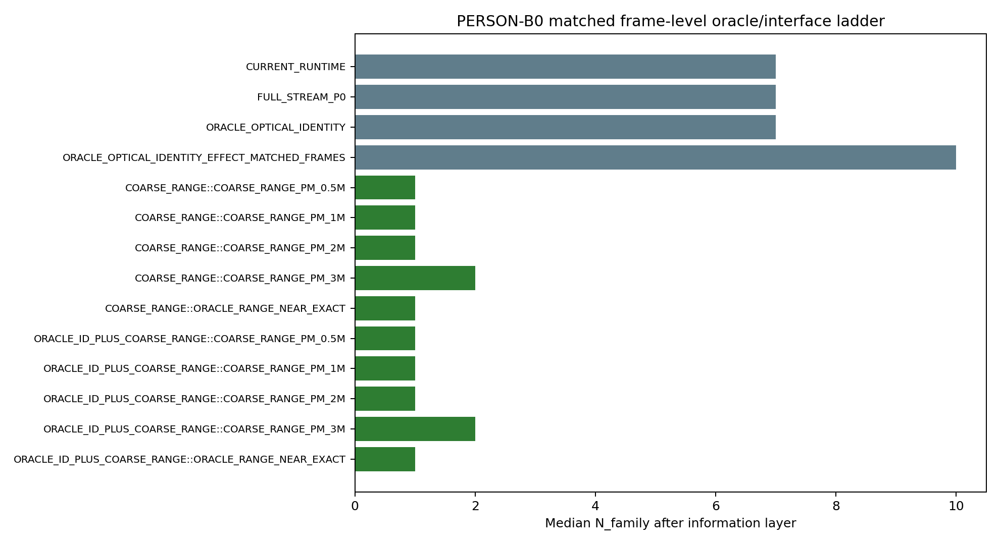

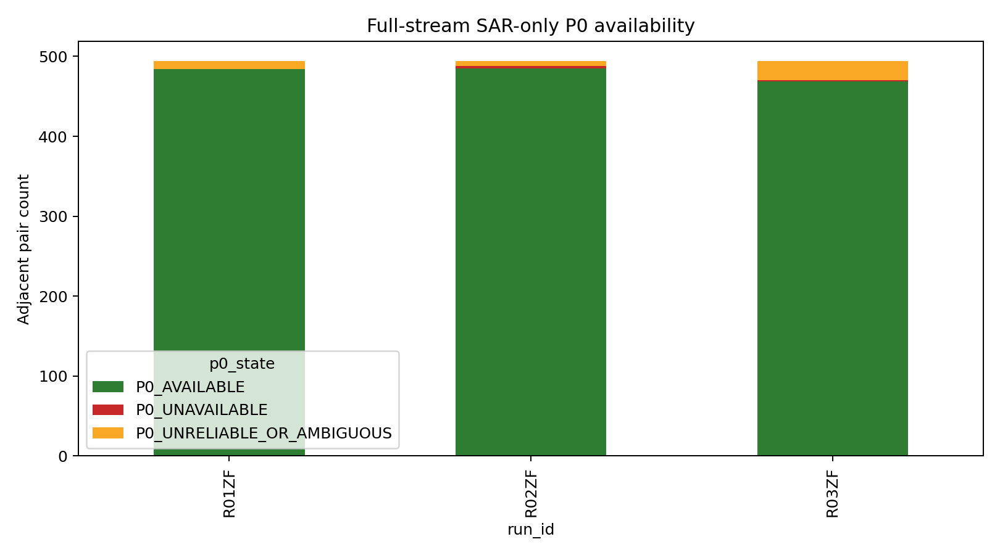

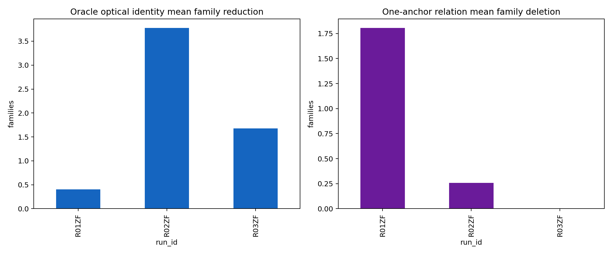

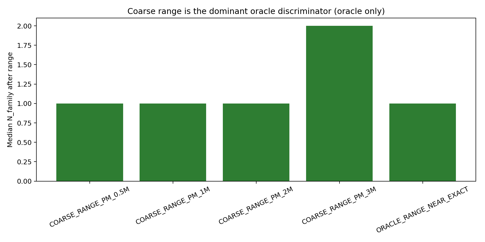

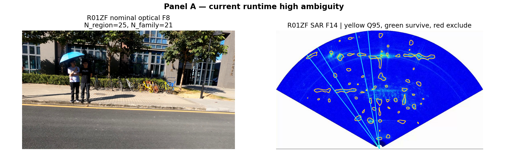

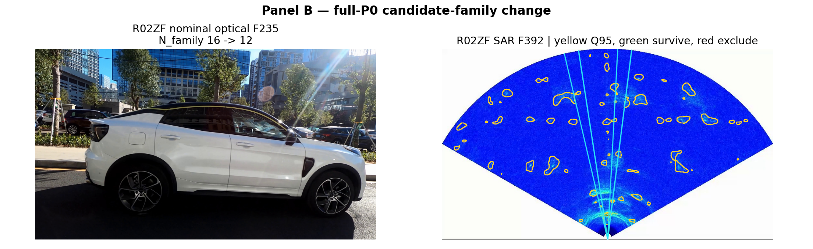

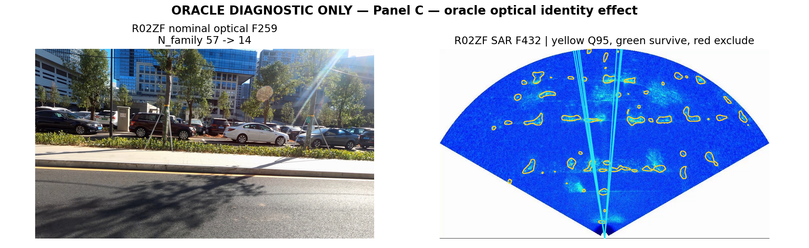

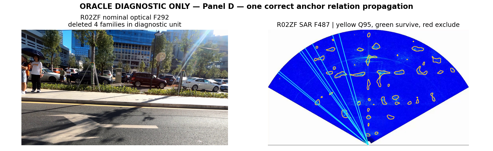

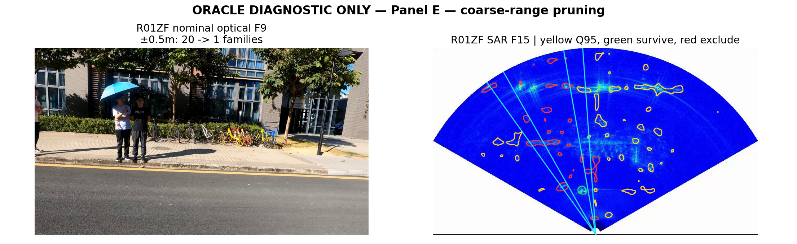

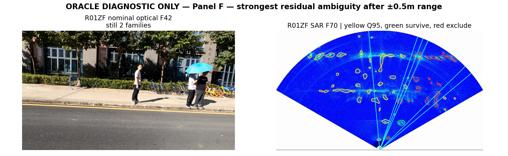

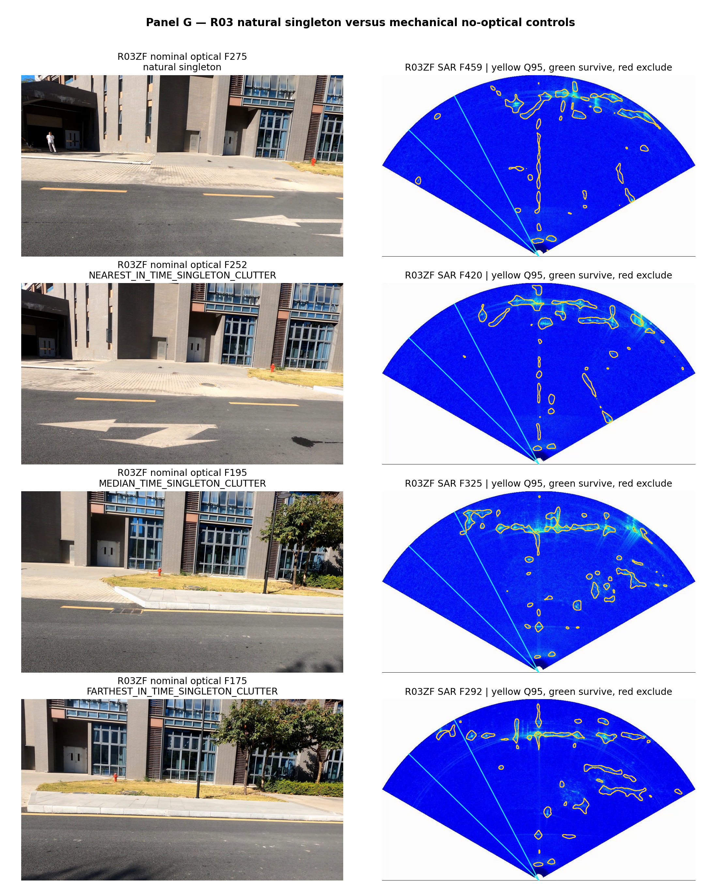

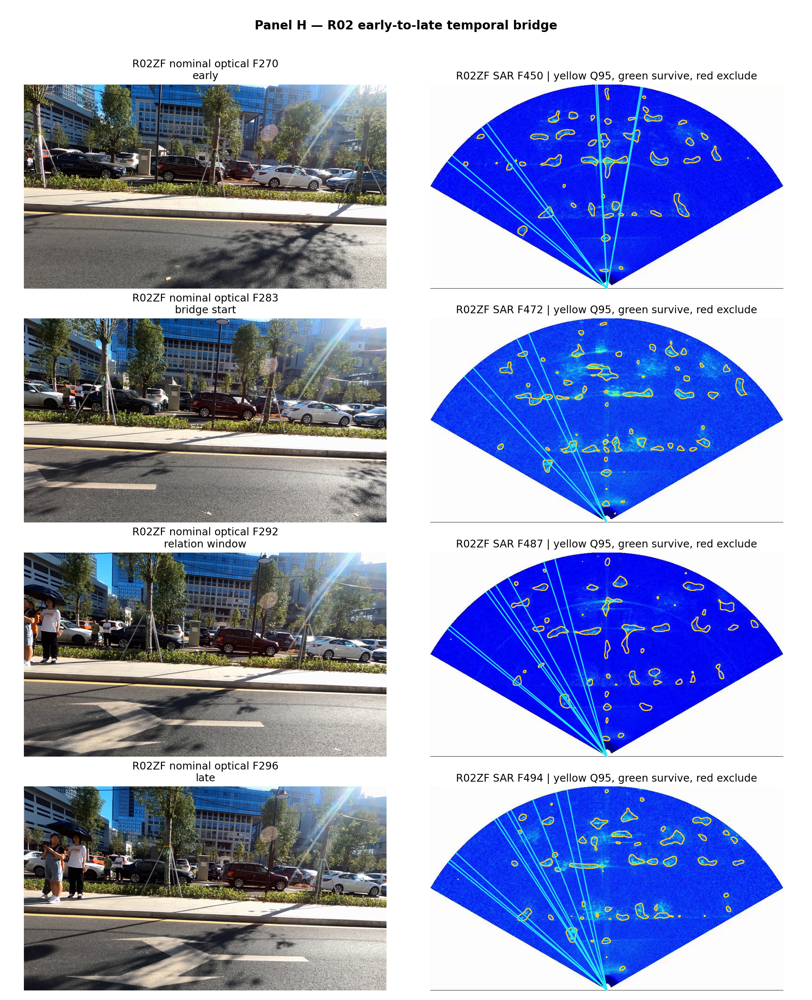
