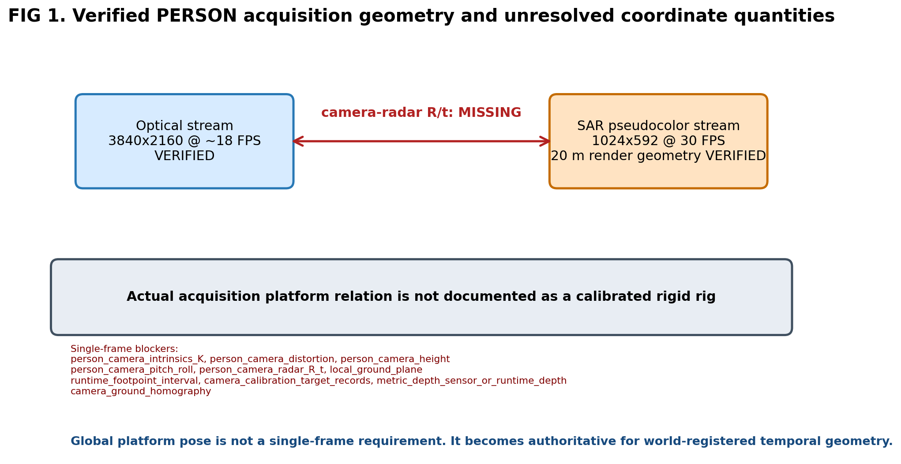
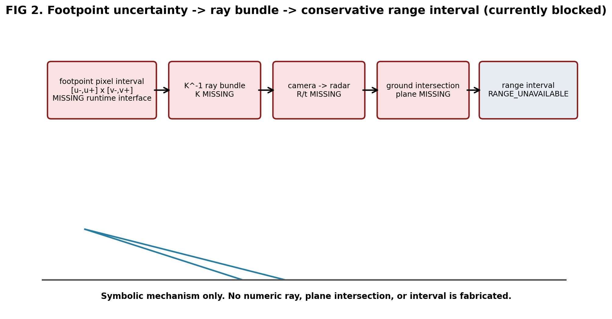
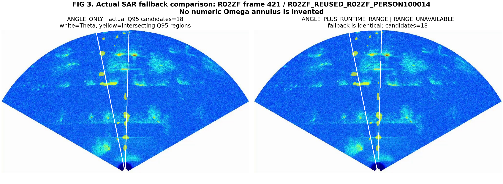
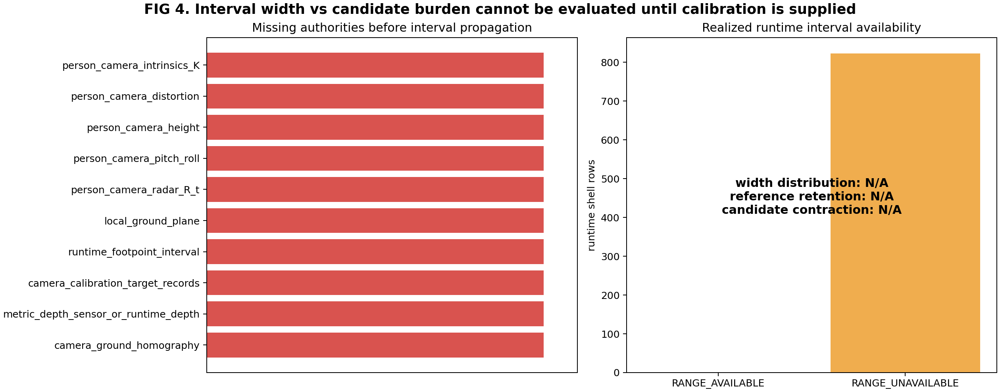
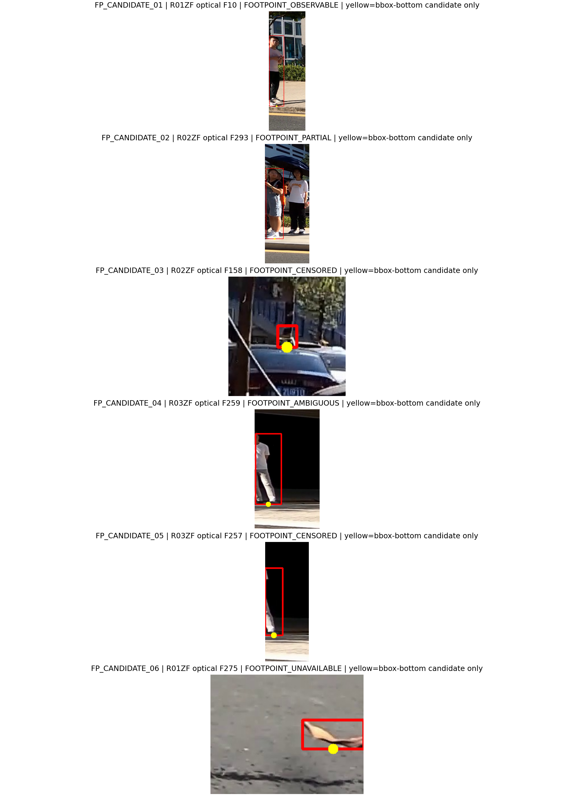

# PERSON-C0 calibrated conservative coarse-range interface

## Direct answer

**我们现在还不具备用几何方法产生 runtime 粗距离区间的条件。** 当前可恢复的是原始/存储图像坐标链、光学/SAR 分辨率与 FPS、光学角度 corridor、以及 SAR 20 m 径向渲染几何；但 PERSON 相机 K/畸变、相机高度与姿态、camera-radar R/t、局部地面、以及 runtime 脚点区间接口均未找到。因此本轮合法结果是 `CALIBRATION_ASSETS_INSUFFICIENT_FOR_RUNTIME_RANGE_PROTOTYPE`，823/823 个 causal shell 退化为 `RANGE_UNAVAILABLE`，没有 PERSON 因 range 被拒绝。

## Ten required answers

1. **Recoverable camera/radar calibration:** no complete PERSON camera/radar calibration was recovered. The found geometry is image/export and SAR fan-render geometry, not a camera K or rigid cross-sensor calibration.
2. **Does single-frame relative range require global platform pose?** no. A current-frame ray/ground intersection can stay in the local radar frame when K, local camera-ground geometry, camera-radar R/t, and a footpoint interval are known. Global pose is a temporal/world-registration requirement.
3. **Minimum missing physical quantities:** PERSON-camera K plus distortion state; camera optical-center height and pitch/roll relative to local ground; camera-radar rigid transform; local ground-plane envelope; runtime footpoint interval/state. A verified homography or metric depth stream could replace part of this chain, but neither exists.
4. **Runtime-legal interval now:** no. `0/823` rows are range available; `823/823` are range unavailable and fall back to `Theta x [0,20 m]` in the current SAR render support.
5. **Realized interval half-width distribution:** unavailable. Median/P75/P90/max are not computed because no interval is legal.
6. **Reference radial-support retention:** unavailable. Manual SAR PERSON reference was never loaded in PERSON-C0 because pre-reference geometry is blocked.
7. **Candidate burden improvement:** no runtime contraction result exists. The actual fallback example is `18 -> 18` Q95 regions because range is unavailable; this equality is a fallback semantic, not evidence that range is useless.
8. **Is +/-2 m realistic now?** not yet answerable. +/-2 m remains a useful oracle-centered engineering scale from the preceding decision study, not a current calibration capability claim. The current condition is wider than +/-3 m in the only honest sense: no bounded interval can be produced.
9. **Is about +/-1 m worth pursuing?** the preceding oracle diagnostic suggests difficult-tail benefit may remain, but PERSON-C0 cannot assess attainability or coverage. First establish real calibration and realized uncertainty widths.
10. **Next step:** collect the minimum calibration package and footpoint interval protocol in `PERSON_C0_MINIMUM_CALIBRATION_CHECKLIST.md`; then run deterministic envelope propagation before any reference reveal. Do not integrate a numeric range into the full flow yet.

## Calibration assets found

- `raw_optical_video_resolution` — FOUND_AND_VERIFIED: Native decoded optical frame geometry.
- `stored_optical_frame_resolution` — FOUND_AND_VERIFIED: PERSON bboxes are expressed in stored native-resolution JPEG coordinates.
- `raw_to_stored_optical_coordinate_chain` — FOUND_AND_VERIFIED: VideoCapture decode followed by direct cv2.imwrite; no resize, crop, or letterbox occurs in export_video.
- `nominal_optical_sar_timestamps` — FOUND_BUT_SEMANTICS_UNCERTAIN: Timestamps are derived as frame_index/FPS under an unverified zero-offset clock assumption.
- `sar_20m_radial_render_geometry` — FOUND_AND_VERIFIED: Verified current render geometry for range-to-radius support projection; slant/ground physical semantics remain unresolved.
- `optical_angular_corridor_theta` — FOUND_AND_VERIFIED: GT-blind conditional angular search support.
- `historical_geometry_asset_inventory` — FOUND_BUT_SEMANTICS_UNCERTAIN: Independent older audit also records camera intrinsics as not frozen/located.

Raw video verification: all three optical videos are `3840x2160` at approximately 18 FPS (R01ZF=17.999970, R02ZF=17.999966, R03ZF=17.999966); all three SAR pseudocolor videos are `1024x592` at 30 FPS. Current export code decodes and writes optical frames without resize, crop, or letterbox, so the stored coordinate grid remains 3840x2160. This does not create K.

## Missing or incompatible assets

- `person_camera_intrinsics_K`: Strong intrinsic hits after exclusions: 0; none is a PERSON-scene K.
- `person_camera_distortion`: Undistortion state cannot be established.
- `person_camera_height`: Required for a ground-plane ray intersection unless another metric depth interface is recovered.
- `person_camera_pitch_roll`: Ray direction relative to the ground plane is unresolved.
- `person_camera_radar_R_t`: Textual camera/radar extrinsic hits: 7; none provides a verified PERSON transform.
- `local_ground_plane`: A visual assumption that the floor is flat is not a calibrated plane.
- `runtime_footpoint_interval`: bbox bottom is explicitly not accepted as an exact footpoint.
- `camera_calibration_target_records`: Calibration-target textual hits: 0; none belongs to the PERSON acquisition.
- `metric_depth_sensor_or_runtime_depth`: No depth stream, disparity, or metric depth metadata is present.
- `camera_ground_homography`: A homography could replace some explicit parameters, but no such asset exists.

- Historical vehicle azimuth and DepthPro candidates are present but incompatible with PERSON-C0: they are not camera calibration, are not PERSON-scene geometric intervals, and the learned/empirical route is prohibited here.
- Related robot SLAM/IMU code has no PERSON acquisition provenance or frame binding.
- The nominal timestamp mapping remains `NOMINAL_INDEX_FPS_ZERO_OFFSET_UNVERIFIED`.

## Coordinate-chain conclusion

`raw optical MP4 3840x2160 -> OpenCV decode -> no resize -> no crop -> no letterbox -> JPEG 3840x2160` is verified from the current export code and headers. If a native 3840x2160 K is collected, no scale/crop transform is required for these stored frames. If calibration is collected at any other resolution or with different focus/zoom, K must be transformed or recalibrated and verified; direct reuse is forbidden.

## Footpoint visual review

The six reviewed cases include all required states: `FOOTPOINT_OBSERVABLE, FOOTPOINT_PARTIAL, FOOTPOINT_CENSORED, FOOTPOINT_AMBIGUOUS, FOOTPOINT_CENSORED, FOOTPOINT_UNAVAILABLE`. R01 F10 is visually observable; R02 F293 is partial; R02 F158 is censored by a vehicle; R03 F259 is ambiguous at small doorway scale; R03 F257 is boundary-censored; R01 F275 is an unavailable boundary fragment. The computed verdict for every case remains `BBOX_BOTTOM_NOT_ACCEPTED_AS_EXACT_FOOTPOINT`.

## Actual SAR fallback case

Figure 3 uses `R02ZF` frame `421` and exact frozen Q95 pixel intersections. Angle-only has `18` candidate regions. Since range is unavailable, angle-plus-runtime-range intentionally has the same `18` regions. `Omega` remains physical support, not a PERSON box.

## Search coverage and freeze

- Broad filename/type discovery: 282 candidate paths across active workspace, current raw data, and related optical-SAR repositories, excluding archive/old_work/review packs/R04/virtual environments.
- Strong intrinsic text check: 8,644 text files, four matching files/lines, none containing a numeric PERSON-scene K.
- Focused semantic scan: 72 hits in 15 candidate files, classified by provenance and coordinate semantics.
- Pre-reference root SHA256: `f0da23038b95f26d5e881d00e6390b9245f25dc9dbbb464a9cc0b7fb5e14c61b` over `11` files.
- Manual SAR reference loaded: `false`.
- R04 accessed: `false`.

## Figures

## Non-claims

This study does not claim intrinsic RCS, recovered physical motion, causal identity, calibrated probability, metric camera depth, final PERSON center/box, P2, tracker, learned fusion, or R04 confirmation. Q95 regions and P0 families remain conditional SAR image-domain response supports. Optical provides conditional azimuth and optional future range search support only; SAR retains response-family, range-image, and final-localization authority.
