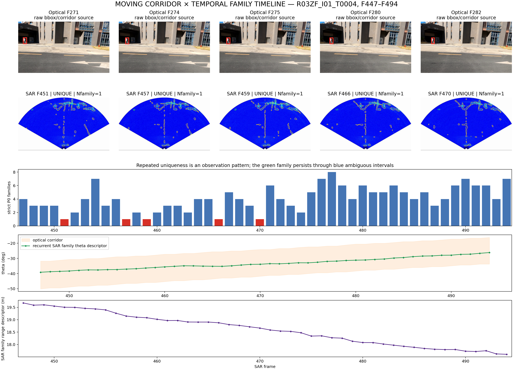
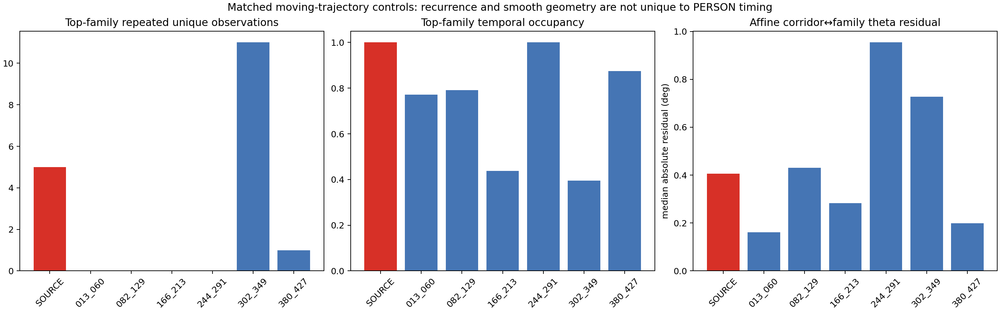
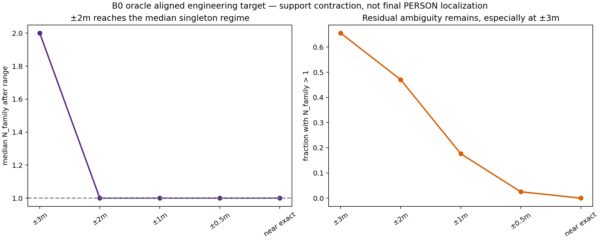
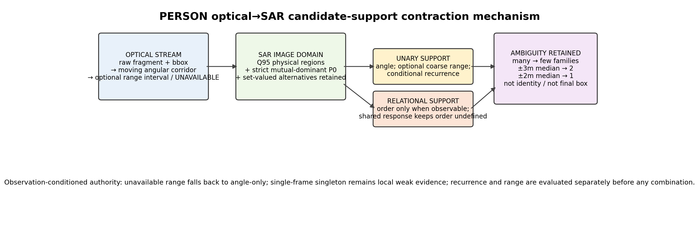

# PERSON range-temporal decision study

## Plain-language answer

**现有时序里有真实的 recurrent-family 支持，但 matched no-PERSON 轨迹也能产生同类结构；它尚不足以替代粗距离。当前更应该补一维可校准的保守粗距离，目标做到约 ±2 m，±3 m 可用但仍常保留多 family，±1 m 在中位数上没有新增收益。**

## Six direct answers

1. **R03 recurrence:** the five singleton frames select one strict mutual-dominant P0 family. That family is admissible for `48/48` frames and unique on `5` frames. This is a real recurrent SAR image-domain support pattern, not five unrelated blobs. It is not by itself PERSON-specific.
2. **Moving-corridor controls:** `6` deterministic same-run, 48-frame, zero-detected-optical-PERSON time shifts retained the corridor trajectory exactly and matched SAR density/P0/boundary nuisance variables without using recurrence outcomes or reference. Their top-family unique counts were `[0, 0, 0, 0, 11, 1]`; empirical source-tail probability is `0.286`. The signal remains descriptive support, not a sufficient unary grounder.
3. **Trajectory geometry:** the source family's affine corridor-to-SAR-theta median residual is `0.406°`, but matched clutter families also produce smooth low-dimensional trajectories. Absolute/coarse depth cannot be recovered because verified timing offset, platform pose/velocity, camera K, mounting geometry and ground plane are absent. SAR-family range evolution is a descriptor, not an optical range estimate.
4. **Likely runtime range source:** a footpoint/ground-plane ray intersection remains the most direct legal interface, but it is not implementable from current files. Camera K, height, pitch/roll, camera-radar R/t, ground plane and synchronized platform pose are missing; bbox bottoms are not yet validated footpoints. Existing vehicle azimuth/depth candidates are withheld or geometrically incompatible.
5. **Required interval width:** B0 gives median `N_family` after range of `2` at ±3 m, `1` at ±2 m, and `1` at ±1 m. Therefore the engineering target is about **±2 m half-width** (roughly 4 m full interval). ±3 m is useful but often leaves alternatives; tighter than ±2 m has no additional median benefit in this development subset.
6. **Single next priority:** implement and calibrate an optional conservative coarse-range interval interface. Keep recurrence records as secondary/backup evidence and a later complement, but do not spend the next cycle deepening recurrence as the sole mainline.

## Matched-control interpretation

The control preserves duration, per-frame corridor width, angular trajectory shape, scene/run, response-density profile, P0 availability and boundary profile. It breaks only the relation between that moving corridor and the time at which the optical PERSON was observed. Control selection is pre-reference and lexicographic on nuisance mismatch; it never sees recurrent-family outcomes.

## Runtime coarse-range feasibility

The post-reference descriptor audit had `119` rows. Rank correlations (`bbox bottom`, `bbox height`) versus reference range were `-0.329` and `-0.777`. These are oracle-aligned diagnostics only and do not establish a range function. No fixed ±2 m was appended to a point estimate.

## R02 azimuth × range support

| range_tolerance_m | prompt_range_group | row_count | reference_range_median | N_family_before_median | N_family_after_median | non_singleton_fraction | reference_radial_support_retained_fraction |
| --- | --- | --- | --- | --- | --- | --- | --- |
| 0.05 | R02_12_TO_14M | 18 | 13.083336087239053 | 9.0 | 1.0 | 0.0 | 1.0 |
| 0.05 | R02_6_TO_8M | 12 | 7.014884285673841 | 3.5 | 1.0 | 0.0 | 1.0 |
| 0.5 | R02_12_TO_14M | 18 | 13.083336087239053 | 9.0 | 1.0 | 0.0 | 1.0 |
| 0.5 | R02_6_TO_8M | 12 | 7.014884285673841 | 3.5 | 1.0 | 0.0 | 1.0 |
| 1.0 | R02_12_TO_14M | 18 | 13.083336087239053 | 9.0 | 1.0 | 0.2222222222222222 | 1.0 |
| 1.0 | R02_6_TO_8M | 12 | 7.014884285673841 | 3.5 | 1.0 | 0.0 | 1.0 |
| 2.0 | R02_12_TO_14M | 18 | 13.083336087239053 | 9.0 | 1.5 | 0.5 | 1.0 |
| 2.0 | R02_6_TO_8M | 12 | 7.014884285673841 | 3.5 | 1.0 | 0.1666666666666666 | 1.0 |
| 3.0 | R02_12_TO_14M | 18 | 13.083336087239053 | 9.0 | 1.5 | 0.5 | 1.0 |
| 3.0 | R02_6_TO_8M | 12 | 7.014884285673841 | 3.5 | 1.5 | 0.5 | 1.0 |

The prompted 6–8 m and 12–14 m strata are physically separated in radial support. Their range intervals can therefore partition families even when azimuth corridors overlap. This is an `AZIMUTH × RANGE` search-support result, not a final PERSON box or identity assignment.

## Strongest counterexamples

- Temporal: `{'trajectory_id': 'R02ZF::R02ZF_REUSED_R02ZF_PERSON017', 'trajectory_kind': 'NATURAL_OPTICAL_CORRIDOR', 'run_id': 'R02ZF', 'strict_family_id': 'P0MF_3D76EE7A60FF52E91451', 'admissible_frame_count': 28, 'unique_frame_count': 0, 'competing_frame_count': 28, 'temporal_span_frames': 28, 'trajectory_length_frames': 41, 'temporal_occupancy': 0.6829268292682927, 'reselection_after_gap_count': 0, 'ambiguous_bridge_count': 26, 'first_offset': 0, 'last_offset': 27, 'admissible_offsets': '0;1;2;3;4;5;6;7;8;9;10;11;12;13;14;15;16;17;18;19;20;21;22;23;24;25;26;27', 'unique_offsets': '', 'range_center_min_m': 7.365175160793943, 'range_center_max_m': 9.72810681528388, 'theta_center_min_deg': -53.95114707946777, 'theta_center_max_deg': -40.91548538208008, 'reference_frame_count': 3, 'reference_radial_support_retained_fraction': 0.0, 'reference_theta_support_retained_fraction': 0.0, 'reference_2d_support_retained_fraction': 0.0}`.
- Range: `{'scenario': 'FULL_STREAM_P0', 'entity_kind': 'RAW_FRAGMENT', 'run_id': 'R01ZF', 'frame_index': 15, 'entity_id': 'R01ZF_REUSED_R01ZF_PERSON001', 'target_id_oracle': 'R01ZF_SARPERSON02', 'range_tolerance_m': 3.0, 'range_oracle_level': 'COARSE_RANGE_PM_3M', 'N_region_before': 23, 'N_region_after': 7, 'N_family_before': 20, 'N_family_after': 7, 'A_candidate_px_before': 7334.0, 'A_candidate_px_after': 2934.0, 'A_candidate_m2_before': 8.389303725263357, 'A_candidate_m2_after': 3.3561790468942854, 'reference_range_retained': True, 'oracle_diagnostic_only': True, 'counterexample_kind': 'PM3M_STILL_MULTIPLE_FAMILIES'}`.
- A visually clean, long P0 family in a no-PERSON matched window remains possible; therefore long continuity and smooth trajectory cannot be promoted to PERSON specificity.
- Near-exact range still multi-family counterexample present: `False`. None exists in the 119-row B0 subset; the residual tail is at ±0.5/1/2/3 m, not near-exact range.

## Visual review

The raw optical/SAR atlases were reviewed directly. R03 confirms a coherent far-range family but an ambiguous small-scale doorway footpoint; matched no-PERSON windows contain equally clean background families; R02 shows multi-person occlusion and boundary censoring; R01 contains both a clean-footpoint ±3 m success and ±3/±2 m residual multi-family failures. See `VISUAL_REVIEW.md` and `post_reference_diagnostic_only/visual_review_ledger.csv`. Visual verdicts are not runtime rules.

## Observation-conditioned authority

- Clean, independently validated footpoint plus calibrated geometry: activate `AVAILABLE_RANGE_INTERVAL`.
- Censored/ambiguous footpoint or missing geometry: `RANGE_UNAVAILABLE`, fall back to angle-only support.
- Stable repeated recurrence: retain as conditional temporal unary support.
- Single-frame singleton: local weak observation only.
- Shared SAR response: retain `SHARED_RESPONSE_ORDER_UNDEFINED`.

## Non-claims

Q95 regions and P0 families are conditional SAR image-domain response supports. This study does not claim intrinsic RCS, recovered physical motion, causal cross-modal identity, final PERSON center, final box, calibrated probability, tracker, classifier, or P2/R04 confirmation. `REFERENCE_RADIAL_SUPPORT_RETAINED` is not true identity retention.

## Core figures

## Frozen sequencing and scope

Pre-reference root SHA256: `dbe75cc78d46752358279509491193b93feceadfee01054ec42a54c804eb4e7e`. Manual reference was loaded only after that tree verified byte-for-byte. R04 accessed: `false`.
