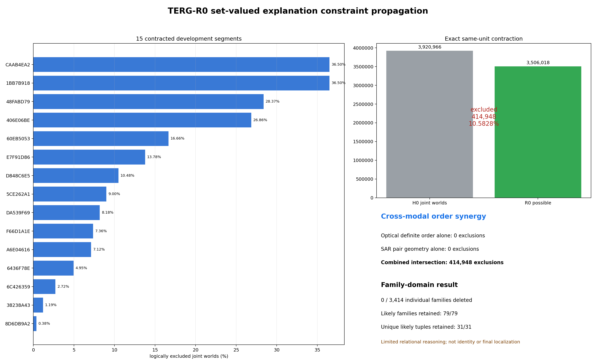
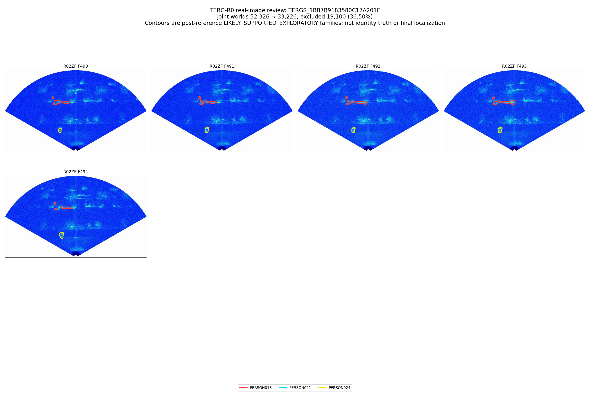
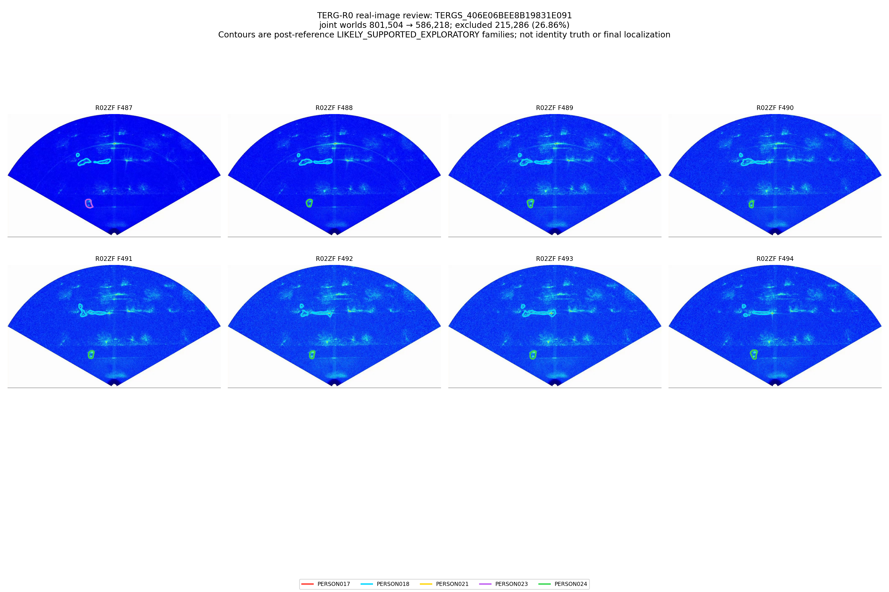
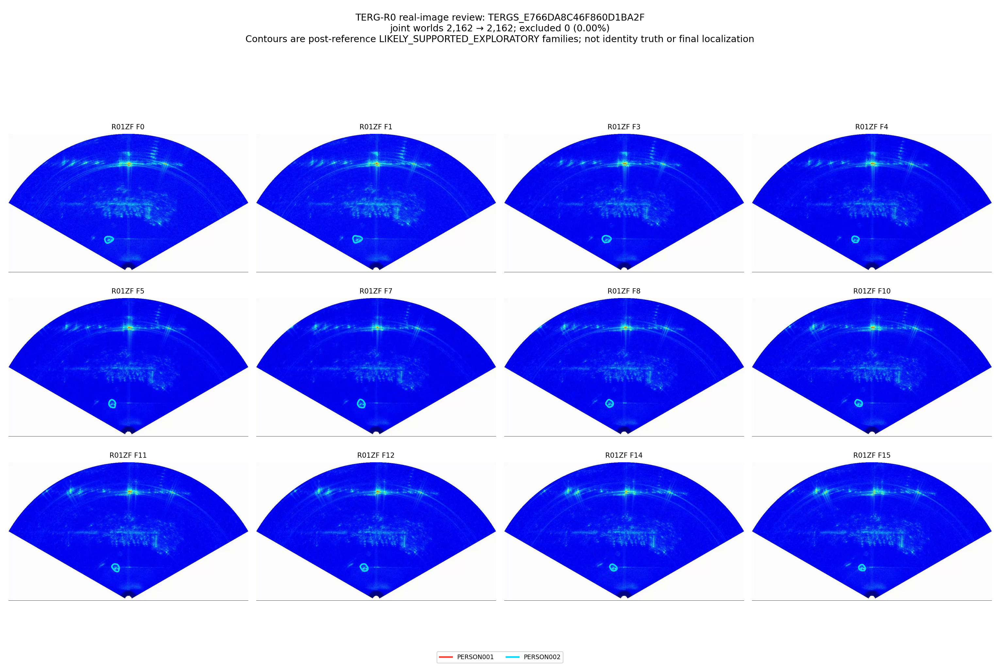
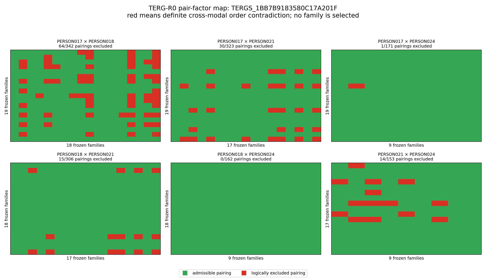
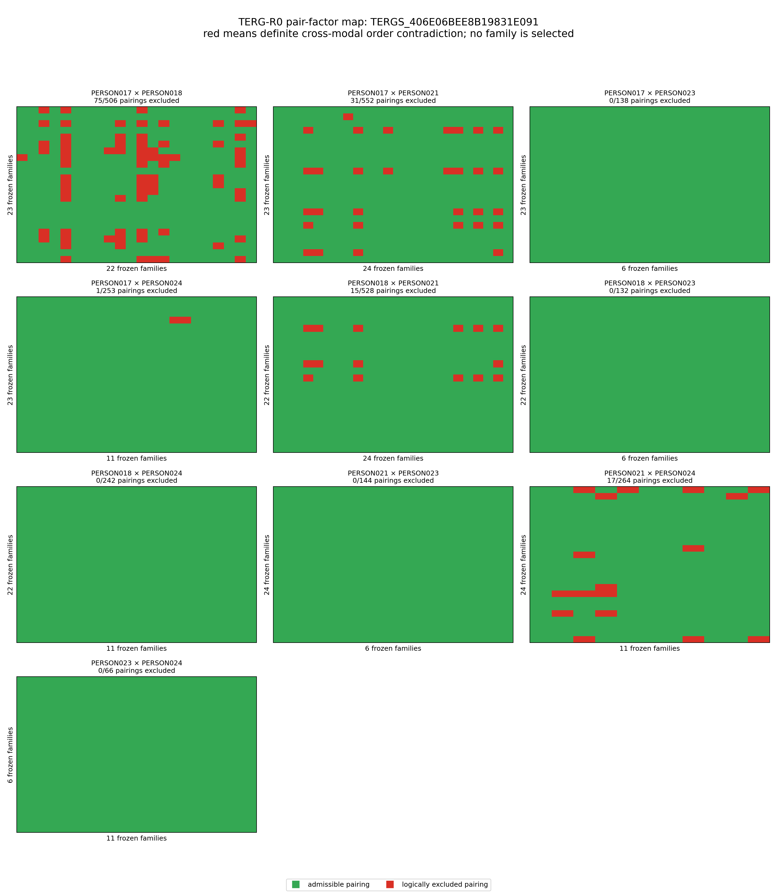

# TERG-R0 集合值解释约束传播：科学机制报告

## 直接结论

路线决策：`TERG_R0_CONSTRAINT_PROPAGATION_MECHANISM_ESTABLISHED`。

TERG-v1 的集合值结构第一次产生了真实但有限的逻辑收缩：在 38 个 development segments 的同单位联合解释世界中，`3,920,966` 个 world 被压缩到 `3,506,018` 个，逻辑排除 `414,948` 个（`10.5828%`），15 个 segment 发生收缩。与此同时，3,414 个单独 family 中没有任何一个被完全删除；收缩发生在“family 的联合组合”层，而不是单 target family-domain 层。

Post-reference exploratory grounding 中，79/79 个 `LIKELY_SUPPORTED_EXPLORATORY` family 被保留；31/31 个每条 track 都恰有一个 likely family 的联合 tuple 也被保留。严格 branch identity 仍为 `STRICT_BRANCH_IDENTITY_EVALUATION_UNAVAILABLE`，所以这些数字不是 identity truth。

## 唯一主公式

一个 explanation world 在一个 segment 内为每条 optical track 选择一个冻结 TERG-v1 upper component family。生命周期、corridor 与 P0 upper temporal structure 已经用于构造 family domain，R0 不循环地再次删除它们。

唯一 hard factor 是 time-shift-robust definite-order contradiction：

1. 两条 optical track 的 raw angular interval 必须在所有共同可观察帧保持同一个确定方向，期间不能出现已观察到的 overlap/uncertain；unavailable 不是反证；
2. 一个 SAR family pair 必须至少有一个共同 SAR support frame；
3. 在所有共同 support frames 上，SAR physical-region envelope 都必须是确定的反方向；
4. 任一 aligned、shared 或 overlap 解释都会使该 pair 保持 admissible。

这不是 threshold、score、vote、top-k、assignment 或 tracker。同步 offset 未标定，因此 nominal-frame 上一次反向不构成 hard exclusion；这也是本轮允许的一次明确逻辑修正。

## 哪类证据真正贡献约束

- lifecycle、corridor、P0 upper connectivity：family-domain construction invariant，不产生新的 R0 exclusion。
- optical definite order 单独：0 exclusions。
- SAR family-pair geometry 单独：0 exclusions。
- 二者集合交集：排除 `414,948` 个 joint worlds，属于 `CROSS_MODAL_ORDER_SYNERGY`。
- shared/topology：保留为 permissive uncertainty，不做 hard gate。
- timing：offset unresolved，不可用于 hard exclusion。

因此突破来自跨模态关系矛盾，而不是某一模态独自宣布哪一个 family 正确。

## 最强收缩案例

| Segment | Tracks | H0 worlds | Possible | Excluded | Fraction |
|---|---:|---:|---:|---:|---:|
| `TERGS_1BB7B9183580C17A201F` | 4 | 52,326 | 33,226 | 19,100 | 36.50% |
| `TERGS_CAAB4EA22C44536DF2CC` | 4 | 52,326 | 33,226 | 19,100 | 36.50% |
| `TERGS_48FABD798C7CE3742190` | 5 | 487,872 | 349,452 | 138,420 | 28.37% |
| `TERGS_406E06BEE8B19831E091` | 5 | 801,504 | 586,218 | 215,286 | 26.86% |
| `TERGS_60EB5053F2693E18D58B` | 5 | 124,032 | 103,368 | 20,664 | 16.66% |
| `TERGS_E7F91D8684FAAF6A9219` | 3 | 1,386 | 1,195 | 191 | 13.78% |

全部 contraction 位于 R02ZF development segments。R01ZF F0–F15 的长连续 response、optional-edge family、shared response、deformation/split/merge hypothesis 和 boundary/censored family 均未因证据弱或拓扑不确定而被删除。

## 正确/likely-supported explanation 保留

- strict confirmed grounding: `0`，严格 identity 评价不可用；
- likely-supported exploratory families: `79/79` retained；
- unique likely joint tuples: `31/31` retained；
- mistaken likely-tuple exclusion found: `0`。

这些只说明当前 development reference interface 没发现 harm，不等于证明唯一 PERSON identity。

## 没有解决的部分与根因

R0 没有删除任何单独 family。每个 family 至少仍能和其他 tracks 的某些 family 形成一个合法 world。根因是：

1. optical 只提供方位 interval，不提供 range authority；
2. shared/overlap 和 deformation/topology uncertainty 在真实图像中确实存在，不能硬化；
3. synchronization offset unresolved，不能把 nominal frame equality 当确定时序；
4. upper family domains 本身很宽，而 definite order 只能排除跨 track 的部分组合。

所以 TERG 已从纯描述机制升级为有限的关系推理机制，但尚不是 single-target disambiguator，更不是最终定位器。

## 等价类

完整 physical membership + R0 constraint signature 下，真实 observational-equivalence merge 数为 `0`。仅仅拥有相同 R0 compatibility status 不足以合并视觉上不同的 families。

## 真实图像审查

共登记 `14` 个必查类别。强 contraction、five-track compound contraction、partial/shared、no-contraction、optional-edge continuity、deformation/split/merge、shared competing relation、human-visible grounding limit、boundary/censored、likely tuple retention 和 harm search 均有图像证据。图像支持窄关系约束，没有发现需要第二次机制修正的反例。

### 图像证据总览

## 下一步

值得冻结 TERG-R0 并寻找新的、未参与 TERG/CMR mechanism shaping 的 held-out run/segment pool。R04ZF 不可作为严格独立确认。当前状态：`NEW_INDEPENDENT_CONFIRMATION_DATA_REQUIRED`。
