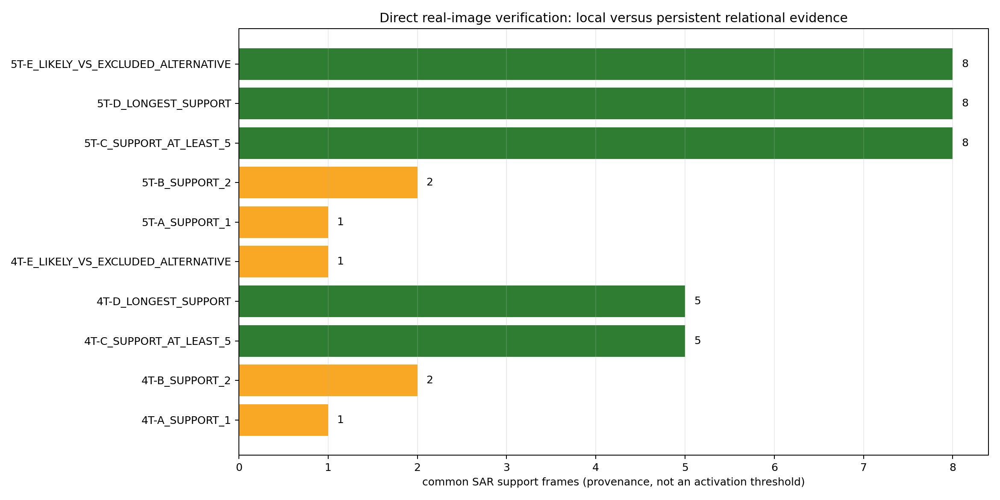
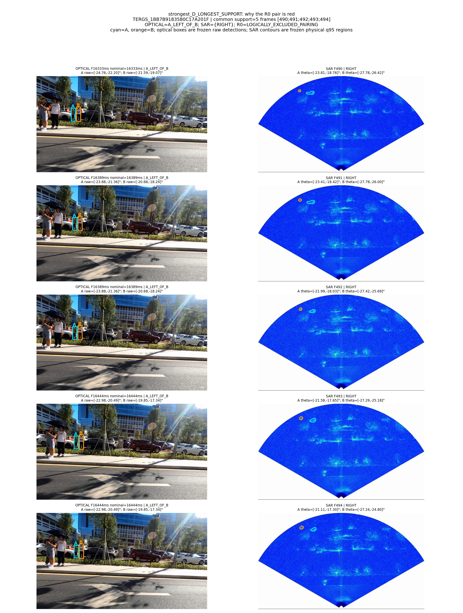
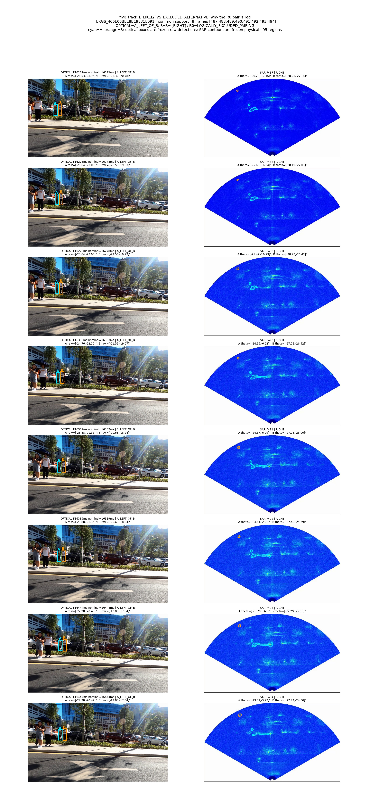
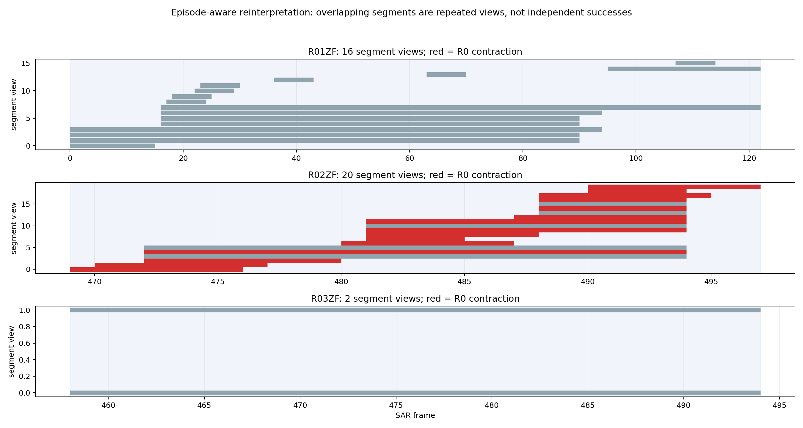
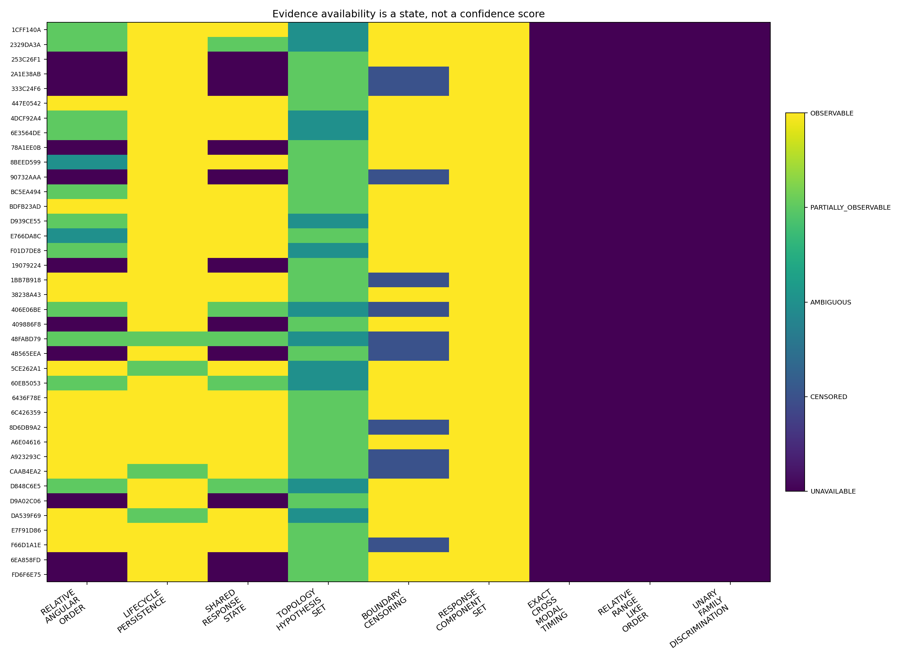
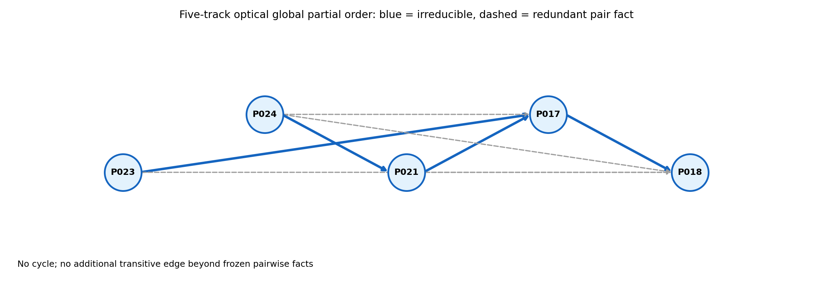
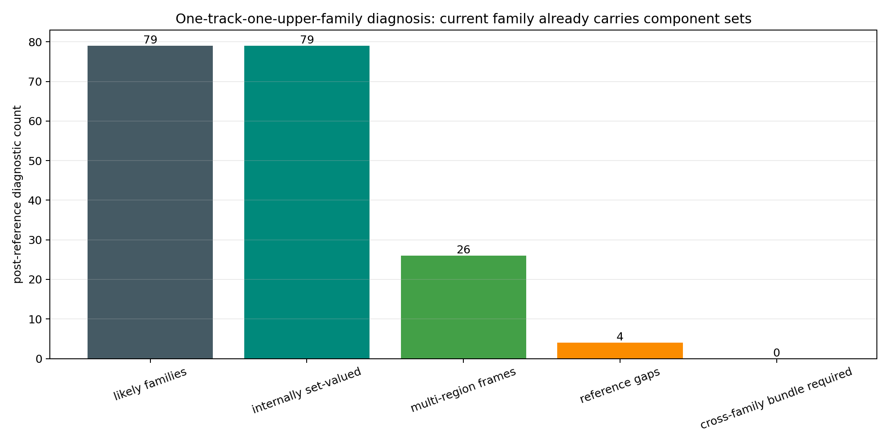
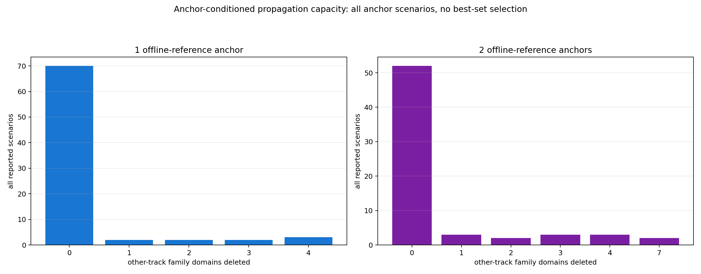

# TERG-R1 自适应证据激活与关系组合：科学报告

## 最直接的结论

最终路线：`RELATIONAL_INFORMATION_REAL_BUT_ABSOLUTE_ANCHOR_REQUIRED`。

现在的问题**不是 optical+SAR 完全没有信息**。真实图像已经证明 relative angular order 是可信的关系信息；冻结 R0 也证明它能排除联合解释，并且在给定一个绝对 family anchor 后，确实能向其他 PERSON domain 传播。

但当前仍缺少一个 runtime-legal、来源清楚的绝对锚点，把“相对次序网络”落到具体 SAR response family。除此之外，lifecycle、component turnover、shared/topology、boundary 与 timing 在当前数据中大多是 structuring、descriptive 或 unavailable evidence，尚未形成新的、跨独立 episode 稳定的 family deletion。因而当前瓶颈首先是 `GROUNDING_LIMITATION + OBSERVABILITY_LIMITATION`，其次才是机制未充分利用；不是已经证实的 fundamental ambiguity，也不是已经证实的 cross-family bundle representation failure。

## 1. excluded pair 现实核验

共人工核验 10 个真实 optical/SAR pack，其中 5 个为 `PERSISTENT_RELATIONAL_EVIDENCE`。1-frame 与 2-frame 案例的反向几何在图上成立，但属于 local evidence，q95 fragmentation 对其时间证据范围有实质影响；长支持案例在完整 support frames 上持续呈现反向次序，因此 relative-order primitive 保留。

没有设置 `support >= N` 的运行阈值。support count、temporal span 与 persistence 只作为 provenance。

下列逐帧图直接展示“红格为什么红”：

## 2. episode-aware 的 R0 重新解释

38 个 segment views 聚成 3 个 overlapping temporal episodes：R01ZF、R02ZF、R03ZF 各 1 个。R0 的 15 个 contracted segments 全部属于同一个 R02ZF episode；1BB7 与 CAAB 是同一证据窗口的重复 view，不能再表述为独立成功。

因此更诚实的分母是：`1/3 episodes show relational contraction`，而不是“15 次独立收缩”。

## 3. evidence availability 与作用分类

availability 逐 segment 记录为 `OBSERVABLE / PARTIALLY_OBSERVABLE / AMBIGUOUS / CENSORED / UNAVAILABLE`，没有统一 confidence score。

- relative angular order：当前唯一 `RELATIONAL_DISCRIMINATIVE` hard primitive；
- lifecycle persistence：`STRUCTURING`，已经构造 TERG-v1 family；
- response component set：`STRUCTURING`，表达 persistent core 与 transient/satellite components；
- shared response、topology、boundary：目前为 `DESCRIPTIVE` 或 guard；
- exact cross-modal timing：3 个 run 全部 `UNAVAILABLE`；
- relative range-like order：没有可靠 observable；
- unary family discrimination：0，未建立。

## 4. global partial order

全部 segment 的 optical definite-order graph 共 69 条 direct edges，0 个 cycle；transitive closure 没有新增冻结 pairwise facts 之外的 edge，但发现 21 条 redundant direct facts。它适合作为一致性表达和证据去重，不产生新的信息或单 family deletion。

## 5. shared transition 探索

post-reference likely family pairs 中没有出现可复核的 `SHARED→SEPARATED` 或 `SEPARATED→SHARED`。仅有两个 RIGHT/OVERLAP 波动序列，且都属于同一 R02ZF episode。当前不能把 shared transition 激活成 hard constraint，更不能把 SAR split/merge 写成 PERSON separation/merge。

## 6. one-track-one-family 是否被推翻

没有。

79/79 个 likely upper families 都已经包含多个 lower-core response components；26/79 个还在至少一帧包含多个 physical regions。对当前 post-reference 可支持区域，唯一 likely family 的 frame coverage 与 region coverage 都为完整覆盖，跨两个 upper families 的 bundle requirement 为 0。

有 4 个 family 的 reference frames 多于当前 candidate-region 可支持 frames，这更像 grounding/observability gap，不能偷换为“需要第二个 family”。所以当前更精确的结论是：TERG-v1 upper family 本身已经是 set-valued temporal response bundle；`X_i=f_i` 的 upper-family选择尚未被现实证据推翻。

## 7. anchor-conditioned propagation capacity

只使用 unique `LIKELY_SUPPORTED_EXPLORATORY` family 做 `OFFLINE_EVALUATION_REFERENCE` counterfactual anchor，不把它当 runtime result，也不搜索“最佳 anchor set”。

- 0 anchor：R0 删除 0 个 individual family；
- 1 anchor：报告全部 79 个场景，9 个场景删除其他 track family，覆盖 7 个 segment views、但仅 1 个 episode，最多删除 4 个；
- 2 anchors：报告全部 65 个场景，13 个场景产生其他-domain contraction，覆盖 6 个 views、仍仅 1 个 episode，最多删除 7 个；
- 所有可用 other-track likely families 均保留。

这证明 relational network 不是完全松散，但 propagation 较窄，且只在同一 episode 得到支持。

## 8. 信息够不够：五类限制分解

| 限制 | 当前结论 | 直接依据 |
|---|---|---|
| `MECHANISM_UNDERUTILIZATION` | PRESENT_BUT_LIMITED | partial-order 可去重；anchor 后有窄传播；没有新 unary/shared-transition hard evidence |
| `REPRESENTATION_LIMITATION` | NOT_ESTABLISHED | likely family 已内部集合值；0 个 cross-family bundle-required case |
| `OBSERVABILITY_LIMITATION` | PRESENT | PERSON023 sparse；exact timing unavailable；optical 不提供 range authority |
| `GROUNDING_LIMITATION` | DOMINANT | runtime-legal anchor 数为 0；post-reference anchor 才触发 domain deletion |
| `FUNDAMENTAL_AMBIGUITY` | REMAINS_LOCALLY_NOT_PROVEN_GLOBAL | shared/overlap/deformation 仍有多解释，但当前不能证明全部 sensor information 根本无解 |

## 9. 需要的下一物理接口

不是再造一个 weighted score。最小缺口是一个来源清楚、runtime-legal 的局部绝对锚点，例如经过独立标定的 camera–SAR absolute geometry/range association，或其他能合法确认一个 SAR response family 与一个 optical hypothesis 对应的稀疏物理观测。它必须与 manual development anchor、offline reference 严格分开。

本轮到此停止：不进入 R04ZF、independent confirmation、P2、final center 或 final box。
