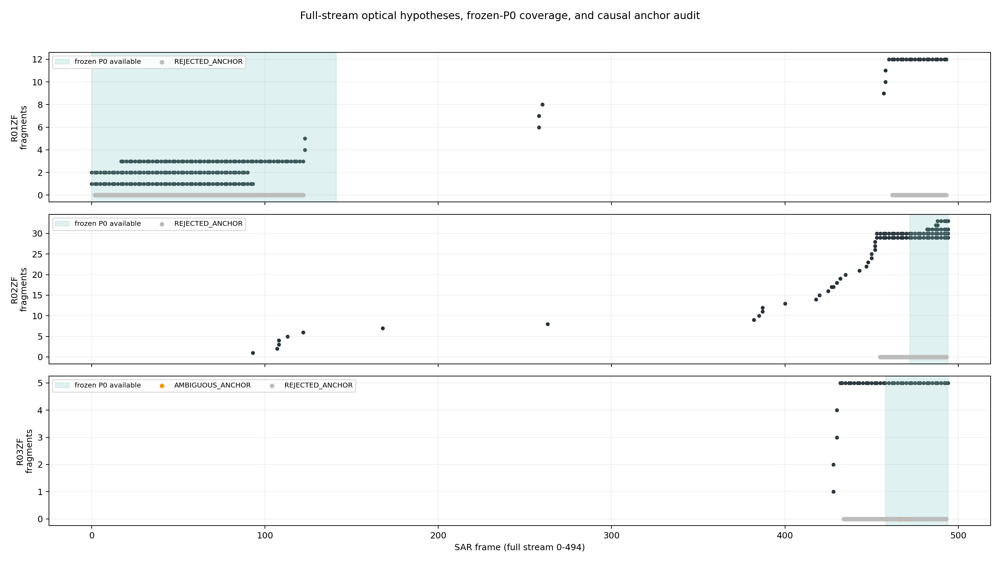
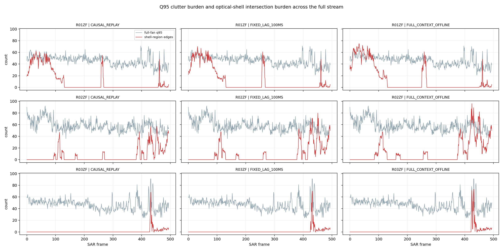
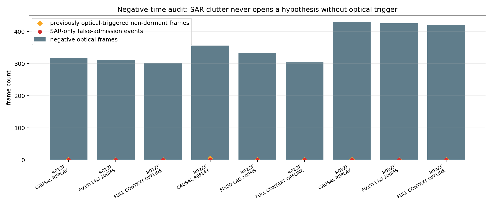
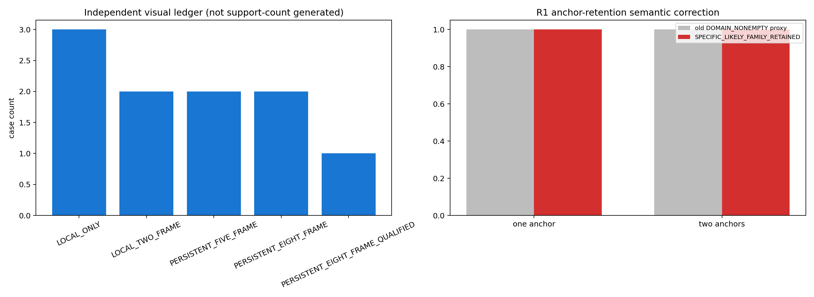
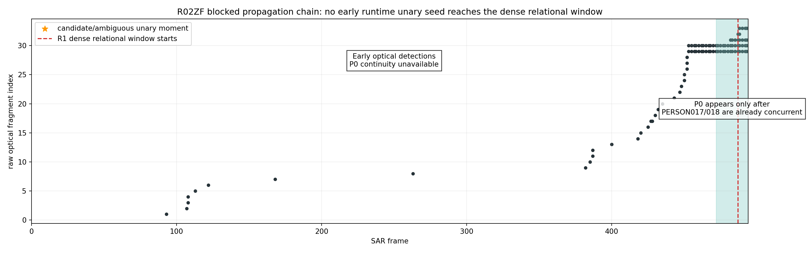

# TERG-R2 scientific report

## Scope and authority

TERG-R2 is a mechanism exploration over complete R01ZF/R02ZF/R03ZF streams. It does not modify TERG-v1/R0/R1/P1E. Optical observations remain time/azimuth/lifecycle/explanation support. SAR remains the authority for image-domain response regions, range, and any future final localization. Raw fragments are hypotheses, not PERSON truth.

## R1 semantic corrections

- Anchor propagation now checks `SPECIFIC_LIKELY_FAMILY_RETAINED` by asking whether an admissible conditioned world still exists with the exact other-track likely family. It no longer substitutes `DOMAIN_NONEMPTY`.
- The old computed case geometry and the new independent visual review are separate ledgers.
- The three interval-overlap connected components are renamed `TEMPORAL_OVERLAP_CLUSTER`; they are not three asserted physical episodes.
- Direct inspection supports freezing `RELATIVE_ANGULAR_ORDER_CONTRADICTION` as an interval-order relational primitive. This does not establish physical identity, PERSON specificity, or final localization.

## Full-stream interface grounding

All three runs contain 495 SAR pseudocolor frames. Frozen geometry is constant within each run. The frozen C2/Q95 computation was replayed on all 1485 frames. On the 202 formerly covered development frames, Q95 label masks are pixel-exact.

The important limitation is different: frozen P0 continuity is not full-stream. Available consecutive-frame fractions are {'R01ZF': 0.2854251012145749, 'R02ZF': 0.044534412955465584, 'R03ZF': 0.0728744939271255}. Outside those spans, the state is `SAR_P0_CONTINUITY_INTERFACE_UNAVAILABLE`; it is not response absence and is never used as exit evidence.

## Full-stream hypothesis management

The prototype opens an `ADMISSION_PENDING` explanation when a raw optical fragment first becomes observable. Repeated optical continuity can move it to `ACTIVE` or `ACTIVE_AMBIGUOUS`. A fragment end without a physical closure condition moves to `DORMANT`; boundary contact becomes `CENSORED_AT_BOUNDARY`; run termination becomes `CENSORED_AT_STREAM_END`. Reentry and new-identity interpretations are retained as competitors when guarded angular supports are compatible.

This is enough to express open/maintain/dormancy/reentry competition, but not enough to know true physical closure. No hypothesis reaches `CLOSED`, because fragment end, boundary contact, and missing detections do not prove that future physical continuation is impossible.

## Three replay modes

- `CAUSAL_REPLAY`: optical observations in `[t-250 ms, t]` only.
- `FIXED_LAG_100MS`: optical observations in `[t-250 ms, t+100 ms]`; 100 ms is an existing fixed interface policy, not outcome-tuned.
- `FULL_CONTEXT_OFFLINE`: full-run runtime-legal raw fragment support is available for state smoothing, while local shell construction uses `[t-250 ms, t+250 ms]`. No stitched identity or SAR reference enters construction.

## Runtime unary anchors

Strong automatic anchors established: **0**.

Candidate/ambiguous moments exist, but none becomes a strong runtime anchor. The decisive reasons are:

1. no runtime-legal optical-to-SAR range interval or equivalent calibrated physical unary observable;
2. frozen P0 continuity is absent over most early/negative-time spans;
3. singleton q95 explanations can also occur during no-optical control time;
4. raw fragment lifecycle boundaries do not imply SAR birth/death or identity;
5. shared/multi-family response remains set-valued.

R02ZF is the clearest failure chain: early optical fragments occur while frozen P0 is unavailable; P0 starts at F472 only after PERSON017/018 are already concurrent, so no early singleton family seed is carried into F487-F494.

## Negative time and admission

No SAR-only clutter frame opens a hypothesis because admission requires a runtime optical trigger. The audit records **0** SAR-only false-admission events. Previously optical-triggered hypotheses can remain non-dormant on local no-shell frames; those frames are reported separately and are not relabeled as new admissions. This is a structural negative control, not a PERSON-GT accuracy result. Singleton/brief optical fragments remain pending or dormant rather than being promoted by confidence thresholds.

## Sparse anchor requirement

The post-reference likely-family stand-in is used only to measure information requirements. One or two sparse anchors can contract some other-track family domains in R1 relational segments, but the corrected ledger separately verifies whether the exact likely family survives. This demonstrates potential propagation capacity, not an automatic runtime result.

## Failure-root classification

The outcome is mixed:

- `MECHANISM_UNDERUTILIZATION`: the old SAR response-region interface was unnecessarily limited; full-stream C2/Q95 is reconstructable and parity-grounded.
- `DEPLOYED_RUNTIME_INTERFACE_GAP`: frozen P0 continuity exists only on selected spans.
- `MISSING_PHYSICAL_OBSERVABLE`: no independent unary range/geometry support exists to turn a low-ambiguity response family into a strong anchor.
- `MISSING_LIFECYCLE_OBSERVABLE`: true closure and reentry identity cannot be resolved from fragment end/boundary contact alone.

## Direct answers

1. **When to open/keep/dormant/recover/close?** The prototype can open, keep, and place hypotheses into dormancy; it explicitly creates reentry/new-identity competing explanations. It cannot yet make a scientifically justified true-close decision, so it censors rather than fabricates closure.
2. **Does the full stream naturally produce a runtime-legal unary anchor?** It produces candidate/ambiguous singleton moments, but no strong automatic runtime-legal unary anchor survives clutter controls and the missing range/P0 limitations.
3. **What minimum absolute information is still needed?** At minimum, one runtime-legal coarse range interval (or an equivalent calibrated unary physical constraint) at a low-ambiguity moment, plus deployable P0 continuity across the interval that connects that moment to the later relation graph. A sparse manual anchor can substitute diagnostically, but must remain labeled manual. This is the smallest credible path from local anchor to temporal propagation to multi-person relation constraints to family-domain contraction.

## Figures

