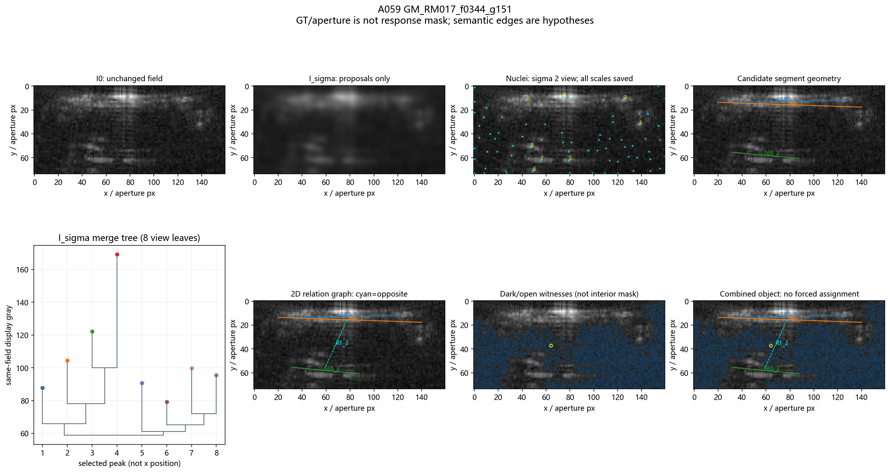
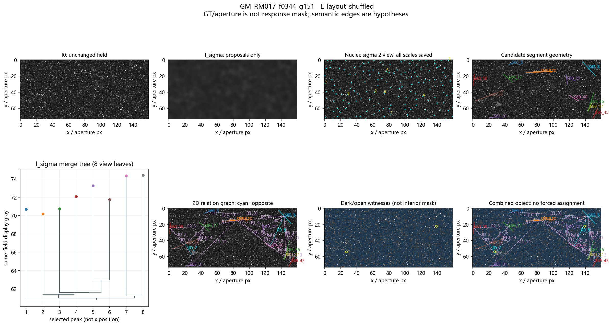
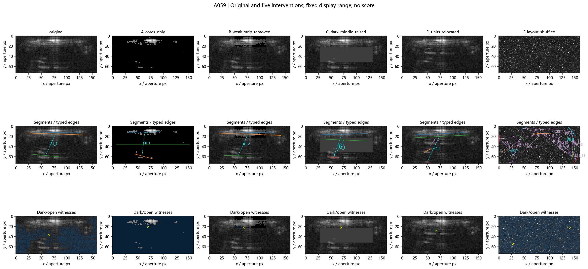
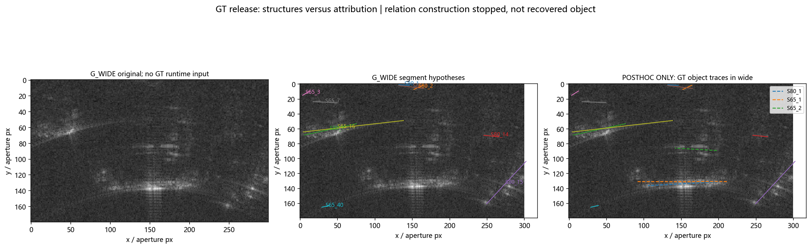

# 一个真实案例及其结构破坏反例

这是完整实验的少量、可离线阅读的示例，不需要本地 442 样本或原始数据目录。
真实观察只有 **GM17 A059 / f344 g151** 一例；shuffled 是它的同源显示干预，
不是第二辆车、负样本或物理反事实。没有新增实验或阈值调整。

## 先看图



上方主带、下方弱片段和两者间的暗区域形成可读的二维组织。
`S65_1—S65_2 / R1_2` 保存对侧、间隔和较低水平合并的候选解释。
但是弱侧的拟合弦跨过真实暗断口，不能把它当作连续脊或目标中心线；
蓝色暗区会向 aperture 外围渗出，不是车辆内部 Mask。



置换精确保留原图灰度多重集，却破坏了两侧、暗内部和弱支撑的二维布局。
程序仍生成许多短段及“对侧”等关系：**图看起来丰富，不代表原组织还在**。
这是当前提议/语义层的失败证据，不是成功案例或分类结果。



A 只保留强核，B 删除冻结上方区域的部分弱支撑，C 将冻结中部抬至至少 q85，
D 交换两个等大小区域，E 打乱全部像素。A/C 还会在常值替换平台上产生伪段。
请比较每列原场与对应结构覆盖，不按节点/关系数量判断“车感”。



这张图提供 GT-release 的上下文，未附整个宽窗口对象数据。左图无 GT 运行原场，
中图是运行候选段，右图虚线才是事后投回的 GT 对象。可见条带仍在，但对应段
未恢复；核预算停止后没有构建关系。没有移动/扩大窗口或选择一个获胜对象。

## 数据怎么读

`A059_original_field.npz` 和 `A059_shuffled_field.npz` 是实验文件的**字节级原样复制**。
保留二维 I0、I1/I2/I4 分析场及两种场的 merge activation；shuffled 另有可逆像素映射。
I0 是已有 GT chart 的双线性显示采样，不是 native SAR 幅度、复数信号或 RCS。
GT 是车辆几何范围，不是 SAR 响应 Mask。

两个 `*_object.json.gz` 保留完整 nuclei、segments、relations、dark_open_regions、
merge_topology、uncertainty；没有选几个漂亮节点冒充全图。为了可移植，仅改写
field 文件引用并移除源机器/未附上下文路径，源文件 SHA256 留在 provenance 和
MANIFEST 中。两份记录的节点 ID 各自独立，不能按同名 ID 声称跨干预身份不变。

只需 Python + NumPy：

```python
import gzip, json
from pathlib import Path
import numpy as np

folder = Path('tasks/morphology_object_v2/examples')
with gzip.open(folder / 'A059_original_object.json.gz', 'rt', encoding='utf8') as f:
    obj = json.load(f)
field = np.load(folder / obj['full_field']['file'])
print(field['I0'].shape)
edge = next(r for r in obj['relations'] if r['id'] == 'R1_2')
print(edge['type'])
print(edge['witness']['I0_merge']['path_xy'])  # 在 I0 上逐点回指的路径
```

`MANIFEST.json` 列出每个数据/图像文件的大小与 SHA256。原图/打乱图的灰度排序
完全相同；按 `original_pixel_to_new_flat` 逆索引可逐像素还原原 I0。源对象中的
多水平树并未因为静态图只显示 8 个叶子而裁剪。

完整分析见 [研究报告](../../../docs/morphology_object_v2_exploration.md)。
导出脚本 [export_examples.py](../export_examples.py) 默认写入独立 output 子目录，
不会改原实验产物；本目录是显式选取后提交的教学副本，不含全量输出。
